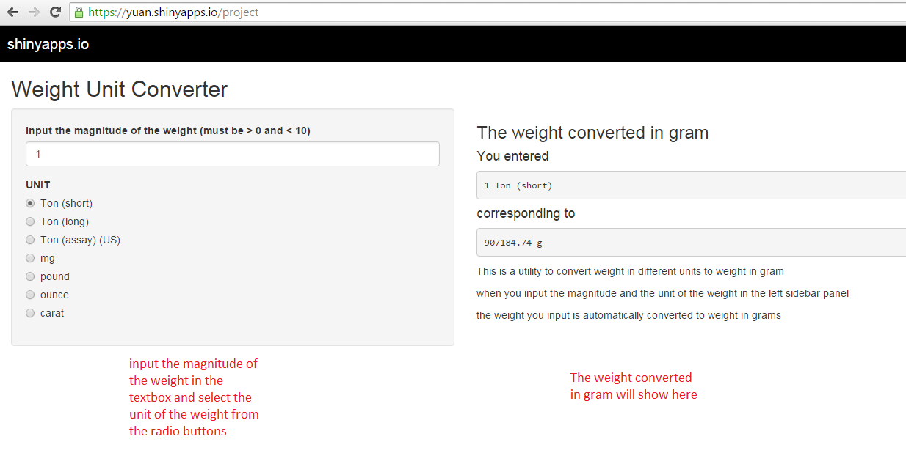

 Welcome to the introduction to this on-line tool that converts weight in different units to gram.

The web page of this online tool is shown here.

Once you input the magnitude of the weight and choose the corresponding weight unit, the weight you input will be converted to weight in gram

---

This weight unit converter currently can convert the weights in the following units to gram:
<ul>
  <li>Ton (short)</li>
  <li>Ton (long)</li>
  <li>Ton (assay) (US)</li>
  <li>mg</li>
  <li>pound</li>
  <li>ounce</li>
  <li>carat</li>
</ul>

--- 

If you input the weight of cars in mtcars data (datasets package) to this tool and convert the car weight to gram, then
the histogram of the converted weight in gram are ploted as the follow:

 

Although usually, for cars, we do not use gram to measure their weights!

---

<h1>Thank you for using this online tool. We hope it is helpful to you.
Welcome to use this tool by visiting https://https://yuan.shinyapps.io/project
